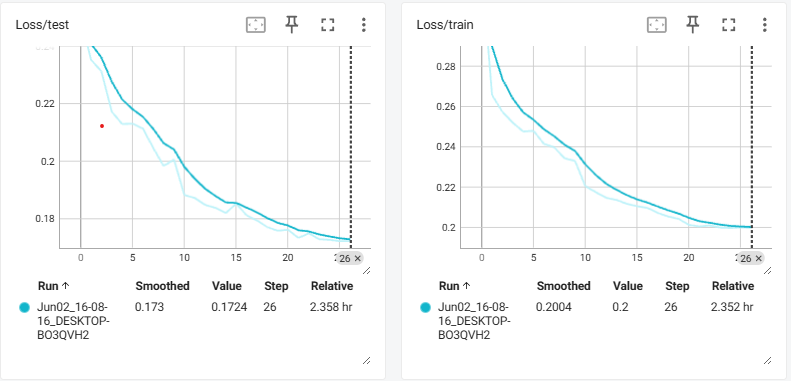
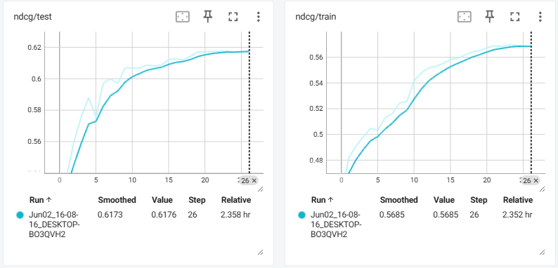

# Istella Deep NN Learn to Rank

Quick little project to create a Deep NN model for Learn to Rank using Pytorch and the Istella dataset

You can get the dataset here: https://istella.ai/datasets/letor-dataset/

In this repository there's two main files:

1. PrepareDataset.ipynb: Used to pre-process the dataset and split into files for each query id since the dataset does not fit all in memory
2. PyTorch Re Ranking.ipynb: Main notebook to create the model and run the experiments.

## Loss (Ranknet -- Pairwise)

## NDCG

